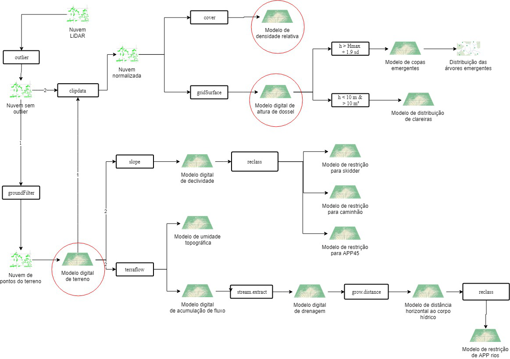
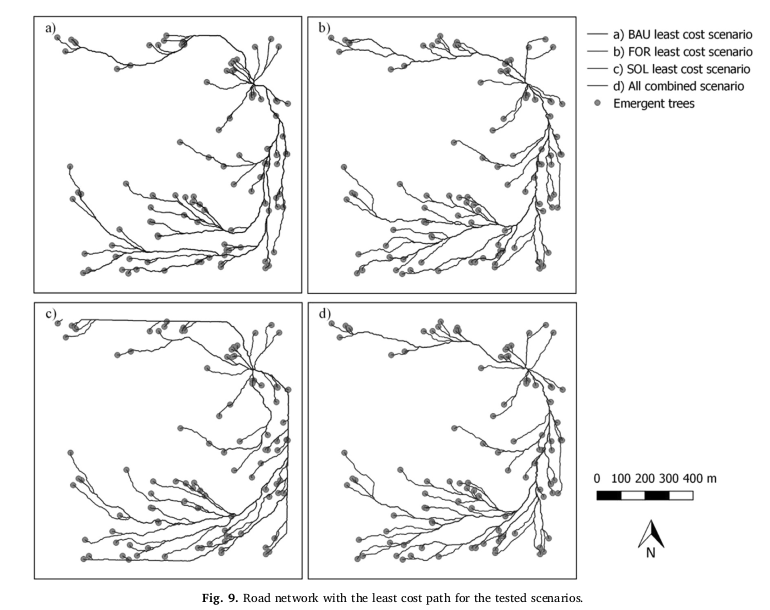
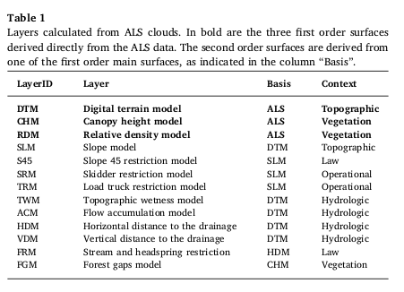
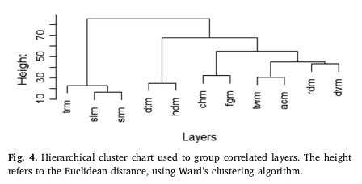
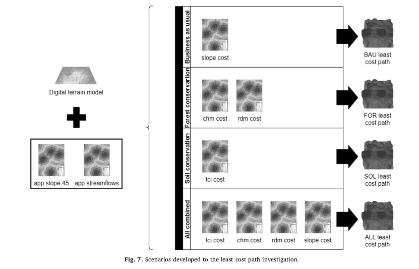

# Otimização multicritério da exploração florestal. 

Coordenador: Eric Bastos Gorgens (UFVJM)

Este projeto visa implementar uma abordagem multicritério para otimizar a extração madeireira em floresta Amazônica, baseado em camadas de informações extraídas de sensor LiDAR (Light Detection and Ranging) aerotransportado. A partir de camadas que descrevem a topografia, a hidrografia, as restrições legais, as restrições operacionais, a vegetação  entre outras, pretende-se avaliar diferentes composições da superfície de custo a ser usada como referência para a otimização. Cada camada de informação será gerada a partir de uma metodologia específica de processamento. Um algoritmo para determinar o trajeto de menor custo ligará o ponto de origem aos pontos que representam as árvores a serem extraídas. Espera-se ao final do projeto apresentar uma análise das informações capturadas pelas camadas criadas, propor quais as melhores camadas e seus respectivos pesos para a construção da superfície de custo e propor uma metodologia replicável para implementação da otimização aqui proposta em futuros planos de manejo. Os resultados serão publicados através de trabalhos de conclusão de curso, relatórios de iniciação científica, dissertações, teses, anais e artigos, além de participação de eventos científicos nacionais e internacionais.

## Apoios recebidos

- Research Stay DAAD
- CNPq Pesquisador Produtividade

## Resumo dos resultados

- Propor uma otimização multicritério para auxiliar o planejamento florestal

Gorgens, Eric Bastos et al. Automated operational logging plan considering multi-criteria optimization. Computers and Electronics in Agriculture, v. 170, p. 105253, 2020.

- Analisar a relevância das diferentes camadas de informação durante o processo de otimização.  

Gorgens, Eric Bastos et al. Automated operational logging plan considering multi-criteria optimization. Computers and Electronics in Agriculture, v. 170, p. 105253, 2020.

- Analisar as diferentes composições e pesos para a criação da superfície de custo a ser otimizada. 

Gorgens, Eric Bastos et al. Automated operational logging plan considering multi-criteria optimization. Computers and Electronics in Agriculture, v. 170, p. 105253, 2020.

- Desenvolver uma rotina de processamento baseado em software livre para implementação da otimização.  

- Analisar as oportunidades da metodologia baseada em sensoriamento remoto frente à metodologia atualmente estabelecida pela legislação florestal brasileira. 
